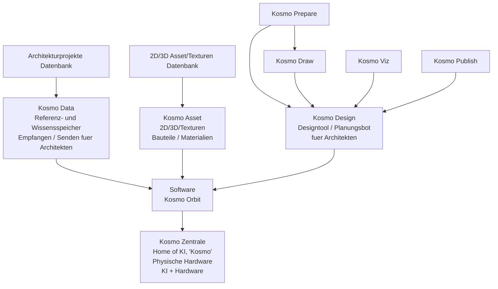

# Architektur Kosmos Network Concept

Stand: 2026-05-25  
Quelle: private lokale Architektur-Kosmos-Konzeptgrafik, nicht im Repo abgelegt.

## 1. Richtige Projektnamen

Der Dachname des gesamten Projekts ist **Architektur Kosmos**.

Der Kern der lokalen KI heisst **Kosmo**. Die Schreibweise im Produktkontext ist `Kosmo`, nicht `KOSMo`. Aeltere technische Notizen koennen noch `KOSMO` enthalten, aber die sichtbare Produkt-/Markensprache folgt dem Bild:

- Architektur Kosmos
- Kosmo Data
- Kosmo Asset
- Kosmo Orbit
- Kosmo Zentrale
- Kosmo Design
- Kosmo Prepare
- Kosmo Draw
- Kosmo Viz
- Kosmo Publish

## 2. Dachidee

Architektur Kosmos ist ein **Hardware + Software Architekten Netzwerk**.

Das System ist nicht nur ein CAD und nicht nur eine Website. Es ist ein lokales und vernetztes Produktionssystem fuer Architekturbueros:

- Datenbanken speichern Architekturprojekte, 2D-/3D-Assets und Texturen.
- Kosmo Data ist der Wissensspeicher, der Informationen fuer Architekten empfaengt und sendet.
- Kosmo Orbit ist die installierte Hauptsoftware und Steuerzentrale, in der die lokale KI Kosmo alle spezialisierten Tools nutzt, ueberwacht, aktualisiert, repariert und miteinander verbindet.
- Kosmo Design ist das zentrale Designtool / der Planungsbot fuer Architekten.
- Kosmo Zentrale ist die physische Hardware und das Zuhause der lokalen KI `Kosmo`.

Produktentscheidung 2026-05-31: Wenn ein Buero Architektur Kosmos kauft,
erhaelt es perspektivisch eine starke lokale Kosmo Zentrale als Hardware plus
KosmoOrbit als Hauptsoftware. Kosmo laeuft lokal auf dieser Hardware und bedient
das Buero ueber KosmoOrbit: Tool-Start, Tool-Verbindung, Monitoring, Updates,
Reparatur, Projektgedaechtnis, Rechte- und Freigabegates, Rollenprofile und
Handoffs zwischen den Untertools. KosmoOrbit ist damit nicht nur ein
Modul-Hub, sondern die operative Software-Zentrale des gesamten Produkts.

## 3. Systemkarte

## 4. Rollen der Hauptmodule

### Kosmo Data

Kosmo Data ist die Wissens- und Referenzschicht.

Sie verbindet:

- Architekturprojekte Datenbank
- Referenzen, Quellen, Rechte, Projektwissen, Materialwissen
- Senden/Empfangen fuer Architekten und andere Kosmo-Module

In den bisherigen Repo-Docs entspricht Kosmo Data der Kombination aus Architecture-Cosmos-Webseite, Referenzatlas, Datenmodell, Quellen- und Rechte-Schicht.

### Kosmo Asset

Kosmo Asset ist die eigene 2D-/3D-/Textur- und Bauteilschicht.

Rolle:

- wiederverwendbare 2D-/3D-Bauteile, Details, Fassadenmodule, Treppen, Stuetzen, Dachformen und Landschaftselemente
- Materialien, Texturen, Asset-Familien, Blender Collections und ArchiCAD-Layer
- Export- und Lizenzlogik fuer Kosmo Design, Blender, ArchiCAD und spaetere Shop-Pakete
- klare Trennung zwischen projektbezogener Referenzbibliothek und wiederverwendbaren Entwurfsressourcen

### Kosmo Orbit

Kosmo Orbit ist die Hauptsoftware, die auf der lokalen Kosmo Zentrale und auf
den Arbeitsstationen im Architekturbuero installiert wird. Es ist die
Bedienoberflaeche, Steuerzentrale und Integrationsschicht, ueber die Kosmo alle
Tools nutzt.

Kosmo Orbit verbindet:

- Kosmo Data
- Kosmo Design
- Kosmo Prepare / Draw / Viz / Publish
- Kosmo Zentrale

Kosmo Orbit kann als Produkt-Shell, Modul-Hub, Plugin-System,
Agenten-Kontrollraum und Buero-Betriebssystem verstanden werden.

Kernaufgaben:

- lokale KI Kosmo starten, ueberwachen, updaten und bei Fehlern reparieren
- Tools, Agenten, Jobs, Datenbanken, Blender-/ArchiCAD-/Cloud-Connectoren und
  lokale Modelle verbinden
- projektbezogene Aufgaben, Freigaben, Unsicherheiten, Rechtepruefungen und
  Qualitaetsgates sichtbar machen
- alle Untertools rollenbasiert oeffnen, vereinfachen oder erweitern
- Benutzerprofile, Rechte und Oberflaechen pro Person steuern
- auf jeder Arbeitsstation einen passenden Zugang zur zentralen Kosmo-Logik
  bereitstellen

Rollenprofile sind Teil des Produktkerns. Erste Zielrollen:

- Chef / Buero-Inhaber: Admin, Strategie, Freigaben, Kosten, Public-Gates
- IT-/KI-Spezialist: Admin, Modelle, Infrastruktur, Updates, Integrationen
- Projektleiter Architekt: Projektsteuerung, Entscheidungen, Review,
  Abgabe- und Koordinationslogik
- Entwurfsarchitekt: Kosmo Design, Varianten, Referenzen, Modelle, Visualisierung
- Zeichner EFZ: Planwerk, Layer, Details, Ausfuehrung, Korrekturen
- Praktikant: gefuehrte Recherche, Modell-/Planassistenz, begrenzte Schreibrechte
- Lehrling: Lernmodus, Erklaerungen, Schulstoff, sichere Uebungen
- Schnupperstift: sehr einfache, gefuehrte Oberflaeche ohne riskante Aktionen

Damit passt sich nicht nur die IT-Verwaltung, sondern auch die eigentliche
Architektursoftware an den Erfahrungsstand und die Verantwortung der Person an.

### Kosmo Zentrale

Kosmo Zentrale ist die physische Hardware und das Zuhause der lokalen KI **Kosmo**.

Rolle:

- lokaler KI-Rechner / HomeStation
- Control Hub
- Agenten-Orchestrierung
- Jobs, Freigaben, Memory, Screen-/Session-Kontrolle
- sichere Verbindung zu Blender, Website, Daten, Android/macOS Control Center und spaeter weiteren Tools

### Kosmo Design

Kosmo Design ist das zentrale Designtool / der Planungsbot fuer Architekten.

Rolle:

- Modellieren, planen, entwerfen
- Blender-/AR-/KI-gestuetzte Designarbeit
- Verbindung von Skizze, Sprache, Geste, Referenz und 3D-Modell
- Ausgangspunkt fuer Planwerk, Visualisierung und Publishing

Kosmo Design ist die wichtigste Untersoftware von KosmoOrbit fuer die
architektonische Produktion. Die Basis entsteht in Kooperation mit den
laufenden Claude-Code-/Cowork-Straengen KosmoDraw, KosmoViz, KosmoPrepare und
KosmoPublish. KosmoOrbit stellt die zentrale Shell, Rechte, Rollen,
Projektpakete und Tool-Orchestrierung; KosmoDesign ist die raeumliche Werkbank,
in der Entwurf, Modell, Plan und Architekturentscheidung konkret werden.

### Kosmo Prepare

Kosmo Prepare ist die Vorbereitungs- und Briefing-Schicht.

Rolle:

- Wettbewerbs-/Projekt-PDF lesen
- Standort, Koordinaten, Baugesetz, Programm, Boundaries und offene Fragen erfassen
- Phase-0-Grundlagenmodell vorbereiten
- Projektgedaechtnis initialisieren

### Kosmo Draw

Kosmo Draw ist die Zeichnungs- und Plan-Schicht.

Rolle:

- 2D-Zeichnen, Plan-Skizze, Grundriss/Schnitt/Ansicht
- Plan-Sketch-to-BIM
- vektorisierte Plaene und Planexporte
- Schnitt-/Geschoss-/Layerlogik

### Kosmo Viz

Kosmo Viz ist die Visualisierungs-Schicht.

Rolle:

- Kameras, Licht, Material, Cycles/EEVEE
- KI-Bildvarianten
- Kompositor, Stilreferenzen, Renderpakete
- Wettbewerbsbilder und Atmosphaeren

### Kosmo Publish

Kosmo Publish ist die Ausgabe- und Publikations-Schicht.

Rolle:

- Plan-/Bild-/Text-/Layout-Pakete exportieren
- Wettbewerbsabgabe, PDF, Bericht, Website-/Datenbank-Promotion
- Freigabe- und Rechte-Gates beachten
- Versionen und Aenderungsprotokolle schreiben

## 5. Abgleich mit bisherigen Namen

| Bisheriger Arbeitsname | Neuer / sichtbarer Name | Bedeutung |
| --- | --- | --- |
| Architecture Cosmos / Architekturkosmos Website | Architektur Kosmos / Kosmo Data | Referenzatlas, Projekte, Quellen, Rechte, oeffentliche Wissensschicht |
| KosmoData | Kosmo Data | Projekt- und Referenzbibliothek |
| KosmoAssets / Asset-Bibliothek | Kosmo Asset | 2D-/3D-/Textur-/Material- und Bauteilbibliothek |
| KosmoZentrale | Kosmo Zentrale | physische KI-Zentrale / HomeStation |
| KosmoDesign | Kosmo Design | Design- und Planungsbot; buendelt Kosmo Prepare, Draw, Viz und Publish |
| KosmoBrief | Kosmo Prepare | Vorbereitung, Briefing, Phase 0 |
| KosmoPlanwerk | Kosmo Draw + Kosmo Publish | Zeichnung, Planwerk, Layout, Export |
| KosmoForm | Teil von Kosmo Design | Entwurf, 3D, Varianten, Modellbildung |
| KosmoVis | Kosmo Viz | Visualisierung, Render, KI-Bildvarianten |
| Modul-Hub | Kosmo Orbit | verbindende Software-Umlaufbahn |

## 6. Produktimplikation

Die Grafik bestaetigt eine wichtige Produktentscheidung:

**Architektur Kosmos ist das Netzwerk. Kosmo ist die lokale KI. Kosmo Zentrale ist die lokale Hardware. KosmoOrbit ist die Hauptsoftware und Steuerzentrale. Kosmo Design ist die wichtigste architektonische Untersoftware und raeumliche Arbeitswerkbank.**

Damit wird die Software-Idee greifbarer:

- nicht "wir bauen ein CAD",
- sondern "wir bauen ein KI-natives Architektur-Netzwerk mit lokaler Hardware, Datenwissen, Designbot und spezialisierten Arbeitsmodulen".

## 7. Naechster sinnvoller Schritt

Die naechste Planungsdatei ist angelegt:

- `docs/kosmo-mvp-0-1-architecture.md`

Sie macht aus dieser Grafik eine MVP-Architektur:

1. Welche Module gehoeren in `Kosmo MVP 0.1`?
2. Welche bestehenden Projekte liefern Code oder Wissen dafuer?
3. Welche Daten fliessen zwischen Kosmo Data, Kosmo Design, Kosmo Orbit und Kosmo Zentrale?
4. Welche Screens/Controls braucht ein Architekt zuerst?
5. Was wird bewusst noch nicht gebaut?
