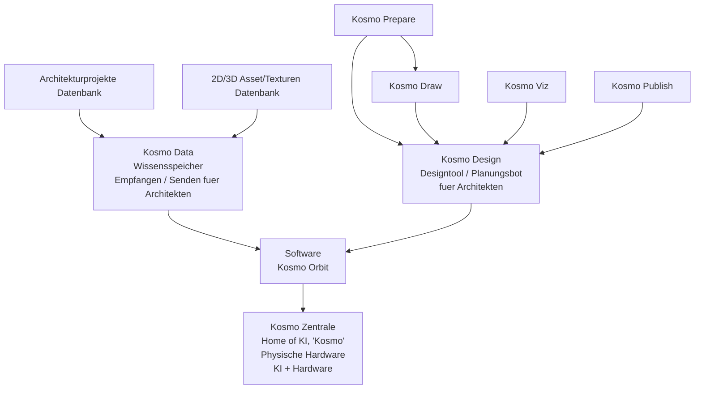

# Architektur Kosmos Network Concept

Stand: 2026-05-25  
Quelle: private lokale Architektur-Kosmos-Konzeptgrafik, nicht im Repo abgelegt.

## 1. Richtige Projektnamen

Der Dachname des gesamten Projekts ist **Architektur Kosmos**.

Der Kern der lokalen KI heisst **Kosmo**. Die Schreibweise im Produktkontext ist `Kosmo`, nicht `KOSMo`. Aeltere technische Notizen koennen noch `KOSMO` enthalten, aber die sichtbare Produkt-/Markensprache folgt dem Bild:

- Architektur Kosmos
- Kosmo Data
- Kosmo Orbit
- Kosmo Zentrale
- Kosmo Design
- Kosmo Prepare
- Kosmo Draw
- Kosmo Viz
- Kosmo Publish

## 2. Dachidee

Architektur Kosmos ist ein **Hardware + Software Architekten Netzwerk**.

Das System ist nicht nur ein CAD und nicht nur eine Website. Es ist ein lokales und vernetztes Produktionssystem fuer Architekturbueros:

- Datenbanken speichern Architekturprojekte, 2D-/3D-Assets und Texturen.
- Kosmo Data ist der Wissensspeicher, der Informationen fuer Architekten empfaengt und sendet.
- Kosmo Orbit ist die Software-Schicht, in der die spezialisierten Kosmo-Module kreisen.
- Kosmo Design ist das zentrale Designtool / der Planungsbot fuer Architekten.
- Kosmo Zentrale ist die physische Hardware und das Zuhause der lokalen KI `Kosmo`.

## 3. Systemkarte

## 4. Rollen der Hauptmodule

### Kosmo Data

Kosmo Data ist die Wissens- und Asset-Schicht.

Sie verbindet:

- Architekturprojekte Datenbank
- 2D-/3D-Asset- und Texturen-Datenbank
- Referenzen, Quellen, Rechte, Projektwissen, Materialwissen
- Senden/Empfangen fuer Architekten und andere Kosmo-Module

In den bisherigen Repo-Docs entspricht Kosmo Data der Kombination aus Architecture-Cosmos-Webseite, Referenzatlas, KosmoAssets, Datenmodell, Quellen- und Rechte-Schicht.

### Kosmo Orbit

Kosmo Orbit ist die Software-Umlaufbahn um die physische Zentrale. Es ist die verbindende Software-Schicht zwischen:

- Kosmo Data
- Kosmo Design
- Kosmo Prepare / Draw / Viz / Publish
- Kosmo Zentrale

Kosmo Orbit kann als Modul-Hub, Plugin-System und Integrationsschicht verstanden werden.

### Kosmo Zentrale

Kosmo Zentrale ist die physische Hardware und das Zuhause der lokalen KI **Kosmo**.

Rolle:

- lokaler KI-Rechner / HomeStation
- Control Hub
- Agenten-Orchestrierung
- Jobs, Freigaben, Memory, Screen-/Session-Kontrolle
- sichere Verbindung zu Blender, Website, Daten, Android/macOS Control Center und spaeter weiteren Tools

### Kosmo Design

Kosmo Design ist das zentrale Designtool / der Planungsbot fuer Architekten.

Rolle:

- Modellieren, planen, entwerfen
- Blender-/AR-/KI-gestuetzte Designarbeit
- Verbindung von Skizze, Sprache, Geste, Referenz und 3D-Modell
- Ausgangspunkt fuer Planwerk, Visualisierung und Publishing

### Kosmo Prepare

Kosmo Prepare ist die Vorbereitungs- und Briefing-Schicht.

Rolle:

- Wettbewerbs-/Projekt-PDF lesen
- Standort, Koordinaten, Baugesetz, Programm, Boundaries und offene Fragen erfassen
- Phase-0-Grundlagenmodell vorbereiten
- Projektgedaechtnis initialisieren

### Kosmo Draw

Kosmo Draw ist die Zeichnungs- und Plan-Schicht.

Rolle:

- 2D-Zeichnen, Plan-Skizze, Grundriss/Schnitt/Ansicht
- Plan-Sketch-to-BIM
- vektorisierte Plaene und Planexporte
- Schnitt-/Geschoss-/Layerlogik

### Kosmo Viz

Kosmo Viz ist die Visualisierungs-Schicht.

Rolle:

- Kameras, Licht, Material, Cycles/EEVEE
- KI-Bildvarianten
- Kompositor, Stilreferenzen, Renderpakete
- Wettbewerbsbilder und Atmosphaeren

### Kosmo Publish

Kosmo Publish ist die Ausgabe- und Publikations-Schicht.

Rolle:

- Plan-/Bild-/Text-/Layout-Pakete exportieren
- Wettbewerbsabgabe, PDF, Bericht, Website-/Datenbank-Promotion
- Freigabe- und Rechte-Gates beachten
- Versionen und Aenderungsprotokolle schreiben

## 5. Abgleich mit bisherigen Namen

| Bisheriger Arbeitsname | Neuer / sichtbarer Name | Bedeutung |
| --- | --- | --- |
| Architecture Cosmos / Architekturkosmos Website | Architektur Kosmos / Kosmo Data | Referenzatlas, Daten, Quellen, Assets |
| KosmoData | Kosmo Data | Wissensspeicher und Datenmodul |
| KosmoZentrale | Kosmo Zentrale | physische KI-Zentrale / HomeStation |
| KosmoDesign | Kosmo Design | Design- und Planungsbot |
| KosmoBrief | Kosmo Prepare | Vorbereitung, Briefing, Phase 0 |
| KosmoPlanwerk | Kosmo Draw + Kosmo Publish | Zeichnung, Planwerk, Layout, Export |
| KosmoForm | Teil von Kosmo Design | Entwurf, 3D, Varianten, Modellbildung |
| KosmoVis | Kosmo Viz | Visualisierung, Render, KI-Bildvarianten |
| Modul-Hub | Kosmo Orbit | verbindende Software-Umlaufbahn |

## 6. Produktimplikation

Die Grafik bestaetigt eine wichtige Produktentscheidung:

**Architektur Kosmos ist das Netzwerk. Kosmo ist die KI. Kosmo Zentrale ist die lokale Hardware. Kosmo Orbit ist die Software-Schicht. Kosmo Design ist das zentrale Arbeitswerkzeug.**

Damit wird die Software-Idee greifbarer:

- nicht "wir bauen ein CAD",
- sondern "wir bauen ein KI-natives Architektur-Netzwerk mit lokaler Hardware, Datenwissen, Designbot und spezialisierten Arbeitsmodulen".

## 7. Naechster sinnvoller Schritt

Die naechste Planungsdatei ist angelegt:

- `docs/kosmo-mvp-0-1-architecture.md`

Sie macht aus dieser Grafik eine MVP-Architektur:

1. Welche Module gehoeren in `Kosmo MVP 0.1`?
2. Welche bestehenden Projekte liefern Code oder Wissen dafuer?
3. Welche Daten fliessen zwischen Kosmo Data, Kosmo Design, Kosmo Orbit und Kosmo Zentrale?
4. Welche Screens/Controls braucht ein Architekt zuerst?
5. Was wird bewusst noch nicht gebaut?
