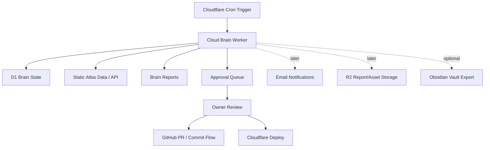

# Architecture Cosmos Cloud Brain V2

Stand: 2026-05-20

## Ziel

Cloud Brain V2 ist die gehostete Version des lokalen `Architecture Cosmos Brain`.
Sie soll ohne Laptop laufen, aber weiterhin kontrolliert bleiben:

- selbstständig beobachten;
- wöchentlich oder täglich Health- und Datenbank-Reports erzeugen;
- Aufgaben, Risiken und Qualitätslücken priorisieren;
- Approval-Aufgaben vorbereiten;
- keine großen Änderungen ohne Freigabe ausführen.

Die Cloud-Version ist damit kein unkontrollierter Autopilot. Sie ist ein
Projektleiter- und Qualitätssystem mit klaren Sicherheitsbremsen.

## Grundprinzip

```text
Observe -> Diagnose -> Propose -> Await Approval -> Execute -> Verify -> Report
```

In V2 werden nur die ersten vier Schritte gehostet vorbereitet. `Execute`,
`Commit`, `Push`, `Publish`, `D1 Write`, `R2 Upload` und `Email Send` bleiben
approval-gated.

## Empfohlene Architektur



## Komponenten

### 1. Cloudflare Worker Cron

Der Worker läuft nach Zeitplan, z.B. täglich oder wöchentlich.
Er führt keine teuren oder zerstörerischen Operationen aus. Seine erste Aufgabe:

- Brain-State laden;
- Datenqualität prüfen;
- aktuelle Tasks aktualisieren;
- Fehler und Drift erkennen;
- Report speichern;
- optional Status-Endpoint bereitstellen.

### 2. D1 Brain State

D1 speichert nur kontrollierte Brain-Metadaten:

- `brain_runs`: einzelne Brain-Läufe;
- `brain_tasks`: erkannte Aufgaben;
- `brain_approvals`: Freigaben und Ablehnungen;
- `brain_errors`: Fehler, Retries, Recovery-Hinweise;
- `brain_reports`: kompakte Reports;
- `brain_obsidian_exports`: optionale Obsidian-Exportläufe.

D1 ist nicht die primäre Architektur-Datenbank für alle Assets. Es ist zuerst der
operative Zustand des Brain.

### 3. Approval Queue

Jede relevante Änderung wird als Task erzeugt. Tasks haben:

- Priorität;
- Risiko;
- benötigte Freigabe;
- vorgeschlagene Aktion;
- mögliche Tests;
- Public/Private-/Rights-Hinweis.

### 4. Status Endpoint

V2 startet mit read-only Endpoints:

```text
GET /api/brain/status
GET /api/brain/latest-report
GET /api/brain/tasks
```

Keine Schreib-Endpoints in der ersten Cloud-Version.

### 5. Obsidian Vault Integration

Obsidian wird als Wissens- und Research-Interface evaluiert, nicht als
ungesicherte Datenbank. Sinnvolle Rolle:

- menschenlesbare Projekt- und Quellen-Notizen;
- Daily/Weekly Brain Reports;
- Research Packs;
- Architekturbegriffe, Material- und Struktur-Taxonomien;
- Vision-, Konzept- und Entscheidungsnotizen.

Empfohlene Struktur:

```text
Architecture Cosmos Vault/
  00 Inbox/
  01 Projects/
  02 Sources/
  03 Research Packs/
  04 Brain Reports/
  05 Decisions/
  06 Taxonomies/
  07 Blender + 3D/
```

Wichtig: Obsidian ist ein hervorragendes Denk- und Review-Werkzeug, aber nicht
der öffentliche Asset-Speicher. Public/Private-Rechte bleiben im Datenmodell und
im Rights-Gate.

Local preview export:

```bash
npm run brain:cloud-export
npm run obsidian:export
npm run brain:api-smoke
```

Output:

```text
out/obsidian-vault/Architecture Cosmos/
out/brain-review/YYYY-MM-DD/brain-cloud-seed.sql
```

## Approval Gates

Cloud Brain darf ohne Freigabe:

- Status lesen;
- Reports erzeugen;
- D1-Run-Metadaten schreiben;
- Tasks vorschlagen;
- Checks anstoßen, falls sie read-only sind;
- Obsidian-Markdown-Exports als lokale oder private Artefakte vorbereiten.

Cloud Brain muss fragen vor:

- Codeänderung;
- Commit;
- Push;
- Publish;
- D1-Write in produktive Architektur-Daten;
- R2 Upload;
- E-Mail-Versand;
- Benutzer-/Auth-/Upload-Feature;
- Public Asset Veröffentlichung;
- Löschung oder Überschreiben privater Dateien.

## Self-Healing

Erlaubt:

- fehlende Report-Ordner erzeugen;
- abgebrochene Reports als Fehler markieren;
- safe checks einmal wiederholen;
- Diagnose schreiben;
- Folge-Task erzeugen.

Nicht erlaubt:

- stille Source-Code-Fixes;
- stille Deploys;
- stille Datenmigrationen;
- stille Auth-/Security-Änderungen.

## Failure Recovery

Jeder Cloud-Lauf schreibt:

- `started_at`;
- `finished_at`;
- `status`;
- `error_summary`;
- `retry_count`;
- `next_recommended_action`.

Wenn ein Lauf fehlschlägt:

1. Fehler wird in `brain_errors` gespeichert.
2. Ein Task mit Priorität `P0/P1` wird erzeugt.
3. Keine weitere destructive Aktion wird ausgeführt.
4. Der nächste Lauf darf nur read-only prüfen, ob der Fehler noch besteht.

## Phasenplan

### Phase 1: Cloud-Brain Readiness

- D1-Schema definieren.
- Lokalen `brain:cloud-plan` Command ergänzen.
- Lokalen `brain:cloud-export` Command für D1-Seed-Vorschau ergänzen.
- Lokalen `obsidian:export` Command für Vault-Vorschau ergänzen.
- Dokumentation und Approval-Regeln finalisieren.
- Keine Cloud Writes.

### Phase 2: Read-only Worker Status

- Worker-Endpunkte für Status und letzten Report.
- Noch kein Cron-Write.
- Noch keine E-Mail.

Current V2 read-only endpoints:

```text
GET /api/brain/status
GET /api/brain/latest-report
GET /api/brain/tasks
```

These endpoints derive a static snapshot from the repository data bundled into
the Worker. They do not write to D1, R2, GitHub or email.

### Phase 3: Scheduled Reports

- Cron aktiviert.
- D1 speichert `brain_runs`, `brain_reports`, `brain_tasks`.
- Reports bleiben Vorschläge.

### Phase 4: Approval Interface

- UI oder signierte Links für Owner-Review.
- Jede Aktion bleibt explizit.

### Phase 5: Controlled Execution

- Erst nach Security Review.
- GitHub PR statt direkter `main`-Push.
- Publish nur nach bestandenem Check und Freigabe.

## Offene Entscheidungen

- Soll D1 `architecture-cosmos-preview` für Brain-V2 erweitert werden oder eine
  eigene D1-DB `architecture-cosmos-brain` entstehen?
- Sollen Reports zuerst nur lokal/Obsidian oder bereits in D1 gespeichert werden?
- Soll der erste Cron täglich oder wöchentlich laufen?
- Soll Obsidian manuell exportiert werden oder später über ein lokales Sync-Script?

## Empfehlung

Für den nächsten Schritt:

1. Eigene D1-DB `architecture-cosmos-brain` planen.
2. `brain:cloud-plan` lokal laufen lassen.
3. `brain:cloud-export`, `obsidian:export` und `brain:api-smoke` lokal prüfen.
4. Danach erst D1-Binding und Cron vorbereiten.
5. Cron erst aktivieren, wenn Status und Approval-Gates stabil sind.
