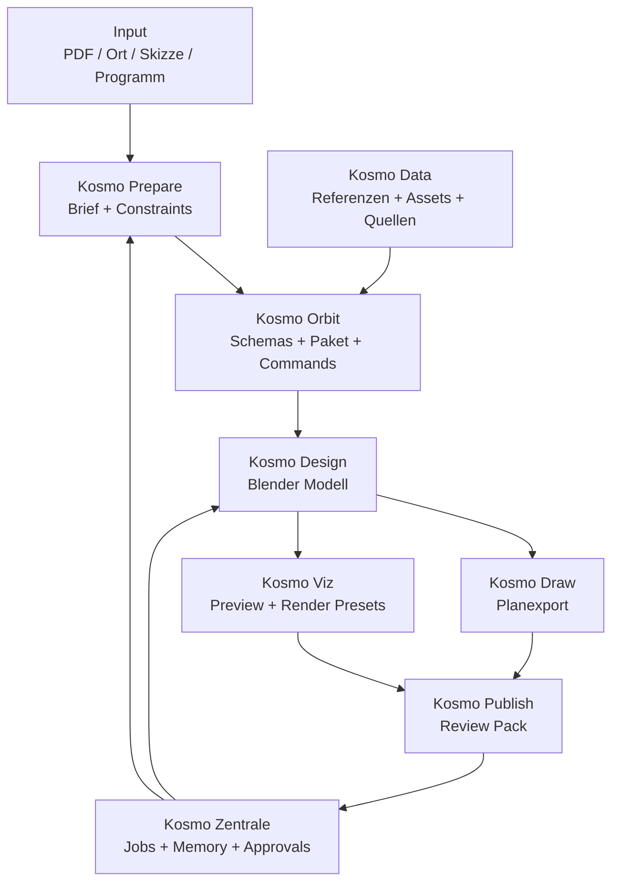

# Kosmo MVP 0.1 Architecture

Stand: 2026-05-25  
Status: Arbeitsarchitektur fuer den ersten durchgehenden Prototyp.

## 1. Ziel

Kosmo MVP 0.1 soll nicht "ein CAD" werden. Der erste Beweis soll sein:

**Von Wettbewerb/Ort/Skizze zu einem nachvollziehbaren Kosmo-Projektpaket mit Brief, Daten, Blender-Grundmodell, einfachem Planexport und Variantenprotokoll.**

Der MVP verbindet die bereits laufenden Stränge:

- Kosmo Data / Architecture Cosmos
- Kosmo Zentrale / Control Hub
- Kosmo Design / AR-Blender-Claude
- Blender / ArchViz / Kosmo Viz
- Notion AI Workflow-Pipeline

## 2. MVP-Schnitt

MVP 0.1 bildet einen schmalen, aber echten Ablauf ab:

1. Projekt anlegen.
2. Wettbewerbs-/Projektgrundlagen erfassen.
3. Kosmo Prepare erzeugt Brief, Constraints und offene Fragen.
4. Kosmo Data liefert Referenzen, Quellen, Rechte- und Asset-Hinweise.
5. Kosmo Design erzeugt in Blender ein erstes bearbeitbares Grundlagen-/Raummodell.
6. Kosmo Draw erzeugt einen einfachen Grundriss/Schnitt-Export.
7. Kosmo Viz erzeugt eine schnelle Standardkamera-/Licht-Preview.
8. Kosmo Publish buendelt lokale Outputs in einem reviewbaren Projektpaket.
9. Kosmo Zentrale protokolliert Jobs, Entscheidungen, Unsicherheiten und Freigaben.

## 3. Systembild



## 4. Kanonisches Projektpaket

Der erste gemeinsame Nenner zwischen allen Modulen ist kein komplexes Backend, sondern ein lokales Projektpaket.

Vorschlag:

```plain text
kosmo-project/
  kosmo.project.json
  brief/
    kosmo-brief.md
    constraints.json
    open-questions.md
  data/
    sources.json
    references.json
    assets.json
    rights-review.json
  design/
    model.blend
    model-profile.json
    variants.json
  draw/
    plans/
    sections/
    exports/
  viz/
    cameras.json
    render-presets.json
    previews/
  publish/
    review-pack.md
    export-manifest.json
    change-log.md
  memory/
    decisions.jsonl
    jobs.jsonl
    uncertainty-log.jsonl
```

Das Paket ist lokal, reviewbar und versionierbar. Es kann spaeter von Kosmo Zentrale, Blender, Website, Android/macOS Control Center oder Cloudflare-Tools gelesen werden.

## 5. Modulumfang MVP 0.1

### Kosmo Prepare

Aufgabe:

- Projektstart, PDF-/Notizen-/Standortaufnahme.
- Extrahiert Programm, Randbedingungen, relevante Daten, offene Fragen.
- Schreibt `brief/kosmo-brief.md`, `brief/constraints.json`, `brief/open-questions.md`.

Minimaler MVP:

- manuelle Eingabe plus optionales PDF-Parsing
- strukturierter Brief
- Liste sicher/unsicher/fehlt

Noch nicht:

- vollautomatische Rechts-/Baugesetz-Pruefung
- autonome Webrecherche ohne Review

### Kosmo Data

Aufgabe:

- Referenzen, Quellen, Rechte, Assets, Material-/Typologiehinweise.
- Verbindung zu Architecture Cosmos / architekturkosmos.ch.

Minimaler MVP:

- lokale JSON-Referenzen aus diesem Repo
- einfache Asset-/Referenzliste
- Rechtefeld: `public_safe`, `internal_only`, `unknown`, `blocked`

Noch nicht:

- Live-D1/R2-Schreibzugriff
- public Upload
- automatische Rechtefreigabe

### Kosmo Orbit

Aufgabe:

- Software-Schicht zwischen Modulen.
- Definiert Schemas, Commands, Paketstruktur und Status.

Minimaler MVP:

- `kosmo.project.json` als zentrales Manifest
- Commands wie `prepare`, `design-import`, `draw-export`, `viz-preview`, `publish-review-pack`
- klare Modulgrenzen

Noch nicht:

- grosser Plugin-Marktplatz
- Cloud-SaaS-Orchestrierung

### Kosmo Design

Aufgabe:

- Blender-native Entwurfs- und Planungswerkbank.
- Erzeugt bearbeitbares Modell aus Brief, Skizze, Text oder einfachen Raumdaten.

Minimaler MVP:

- nutzt bestehende `kosmo_design`-Logik aus AR-Blender-Claude
- Raeume, Waende, Geschosse, Flaechen, Boundary-Layer
- schreibt `design/model-profile.json`
- speichert Varianten in `design/variants.json`

Noch nicht:

- vollstaendiges BIM
- komplexe Tuer-/Fenster-/Bauteilkataloge
- professioneller IFC-Roundtrip

### Kosmo Draw

Aufgabe:

- Planlogik: Grundriss, Schnitt, Ansicht, Axo, vektorisierte Exporte.

Minimaler MVP:

- ein Grundriss pro Geschoss
- ein einfacher Schnitt
- Export als Bild/PDF/SVG, je nach schnellster stabiler Pipeline
- Planstatus im Review Pack

Noch nicht:

- DWG-Perfektion
- vollwertiger ArchiCAD-Ersatz
- komplette Plankopf-/Layoutnorm

### Kosmo Viz

Aufgabe:

- Kameras, Licht, Material, schnelle Previews und spaeter KI-Bildvarianten.

Minimaler MVP:

- standardisierte Kameras
- Sun/Light Preset
- EEVEE Preview oder schneller Cycles Snapshot
- `viz/cameras.json` und `viz/render-presets.json`

Noch nicht:

- grosse AI-Image-Variant-Pipeline
- vollautomatisches Material-Scattering
- finale Wettbewerbsvisualisierung

### Kosmo Publish

Aufgabe:

- Lokales Export- und Reviewpaket.
- Freigabe-, Rechte- und Versionslogik vor jeder externen Publikation.

Minimaler MVP:

- `publish/review-pack.md`
- `publish/export-manifest.json`
- `publish/change-log.md`
- klare Liste: was darf intern bleiben, was ist public-safe, was ist ungeprueft

Noch nicht:

- automatisches Veroeffentlichen
- Website-Promotion ohne Gate
- R2 Uploads oder externe Kundenzustellung

### Kosmo Zentrale

Aufgabe:

- Home of KI `Kosmo`: Jobs, Memory, Approvals, Sessions, Control Hub.

Minimaler MVP:

- Projektpaket registrieren
- Jobs und Entscheidungen loggen
- Freigaben fuer riskante Schritte abfragen
- spaeter Anbindung an Android/macOS Control Center

Noch nicht:

- voll autonome Desktop-Steuerung im MVP-Kern
- unbeaufsichtigte Kosten-/Cloud-/Publish-Aktionen

## 6. Bestehende Projektquellen

| MVP-Bereich | Bestehende Quelle | Nutzen |
| --- | --- | --- |
| Kosmo Data | dieses Repo | Website, Datenmodell, Brain-Tools, Referenz-/Assetstrategie |
| Kosmo Zentrale | OneDrive `Architekturkosmos_Codex_Starter` | FastAPI Control Hub, Jobs, Approvals, Memory, Operator Mode |
| Kosmo Design | privates lokales AR-/Blender-Projekt | Blender Add-on, Plan-Sketch-to-BIM, Action-Bus, AI/Voice |
| Kosmo Viz | ArchViz Toolkit / Blender-Claude | Cycles, ComfyUI/SDXL, Materialkatalog, Kamera-/Renderpipeline |
| Kosmo Workflow | Notion `AI (2)` | Phase-0/Phase-1 Pipeline, Toolkits, Innovationsliste |
| Blender Basis | Offizielle Blender APIs/Manuals | Python API, Geometry Nodes, Physics, Cycles/EEVEE, Asset Libraries |

## 7. Erste Datenvertraege

### `kosmo.project.json`

```json
{
  "schema_version": "0.1",
  "project_id": "kosmo-demo-001",
  "name": "Kosmo Demo Project",
  "created_at": "2026-05-25",
  "site": {
    "address": "",
    "latitude": null,
    "longitude": null,
    "north_rotation_degrees": 0
  },
  "modules": {
    "prepare": "pending",
    "data": "pending",
    "design": "pending",
    "draw": "pending",
    "viz": "pending",
    "publish": "pending"
  },
  "risk_level": "local_review_only"
}
```

### `brief/constraints.json`

```json
{
  "program": [],
  "site_boundaries": [],
  "building_law_constraints": [],
  "design_goals": [],
  "open_questions": [],
  "uncertainties": []
}
```

### `design/model-profile.json`

```json
{
  "units": "meters",
  "stories": [],
  "rooms": [],
  "walls": [],
  "areas": [],
  "collections": [],
  "source_confidence": "conceptual"
}
```

## 8. Review Gates

MVP 0.1 bleibt lokal und review-first.

Gates:

- Public Website Update: menschliche Freigabe.
- R2/D1/Cloud Upload: nicht im MVP.
- Externe E-Mail/Kundenversand: nicht im MVP.
- KI-generierte Referenz/Asset: immer als `generated` und `needs_review`.
- Recht/Baugesetz/Norm: immer als `advisory`, nicht als verbindlicher Nachweis.

## 9. MVP-Demo-Szenario

Ein gutes erstes Demo-Szenario:

1. Man legt ein Demo-Projektpaket an.
2. Man gibt Standort, grobes Raumprogramm und 3-5 Constraints ein.
3. Kosmo Prepare erzeugt Brief und Fragen.
4. Kosmo Data schlaegt 3-5 passende Referenzen oder Asset-Typen vor.
5. Kosmo Design erzeugt in Blender ein simples zweigeschossiges Raum-/Wandmodell.
6. Kosmo Draw erzeugt einen Grundriss und einen Schnitt.
7. Kosmo Viz setzt Kamera, Sonne und Preview.
8. Kosmo Publish erzeugt ein Review Pack mit Outputs, Unsicherheiten und naechsten Schritten.

## 10. Erste Umsetzungsschritte

Status 2026-05-25:

1. `kosmo.project.json` Schema und Beispielprojekt in diesem Repo definieren. **Erledigt.**
2. Minimalen lokalen Package-Checker bauen. **Erledigt.**
3. Bestehendes `kosmo_design` Add-on auf dieses Paket lesen/schreiben lassen.
4. Einfachen Planexport aus Blender pruefen.
5. Review-Pack-Generator lokal bauen.
6. Kosmo Zentrale spaeter als Job-Orchestrator an dieses Paket anbinden.

## 11. Was bewusst noch nicht gebaut wird

- vollstaendiges Architektur-CAD
- Blender-Fork
- Live-Cloud-Backend fuer private Projektdaten
- automatisches Publizieren
- automatisches Reverse Engineering proprietaerer CADs
- zertifizierte Statik/Bauphysik/Tageslicht-/Energie-Nachweise
- kommerzieller Installer
- Multi-Office-Collaboration

## 12. Erfolgskriterium

MVP 0.1 ist erfolgreich, wenn ein Architekt sagen kann:

> Ich gebe Kosmo ein Projekt, einen Ort und eine Idee. Kosmo baut daraus lokal ein erstes strukturiertes Projektgedaechtnis, ein editierbares Blender-Modell, einen einfachen Planexport und ein Review-Paket, ohne meine Daten unkontrolliert nach aussen zu geben.

## 13. Angelegte Vertragsdateien

Der erste Datenvertrag ist im Repo angelegt:

- `schema/kosmo-project-package.schema.json`
- `examples/kosmo-projects/kosmo-demo-001/kosmo.project.json`
- `examples/kosmo-projects/kosmo-demo-001/`
- `scripts/kosmo-project-package-check.mjs`

Pruefung:

```bash
npm run kosmo:package-check
```

Aktueller Status: Der Demo-Vertrag und alle JSON/JSONL-Artefakte bestehen den lokalen Package-Check.
